# Topologia e Fluxo - Sistema de Agentes de Vendas (Consulta ISP)

**Versão:** 1.1
**Data:** 2026-04-16
**Escopo:** Sistema de agentes de vendas AI (`agentes-sistema/`)
**Stack:** Node.js + Express + SQLite + Claude AI + Z-API + Docker + Caddy

---

## Contexto de negócio (IMPORTANTE antes de ler a topologia)

Dois sistemas convivem sob o nome "Consulta ISP" e **não devem ser confundidos**:

| Sistema                          | O que é                                                                                       | Papel no ecossistema           |
| -------------------------------- | --------------------------------------------------------------------------------------------- | ------------------------------ |
| **Consulta ISP** (produto)       | Plataforma SaaS de **análise de crédito para provedores de internet (ISPs)**. É o que se vende. | Produto comercializado         |
| **Sistema de Agentes AI** (este) | Ferramenta interna com 7 agentes de IA que **prospectam, qualificam e fecham vendas** do Consulta ISP. | Motor comercial / growth       |

**Todos os diagramas e descrições abaixo se referem ao Sistema de Agentes AI.** Os "leads" são ISPs brasileiros (donos, diretores comerciais, gestores financeiros de provedores) que são prospects do produto Consulta ISP. Quando um campo como `leads.provedor` aparece, significa o nome do ISP prospect (ex: "NetConnect Fibra"); `num_clientes` é quantos assinantes esse ISP tem; `erp` é o ERP operacional do ISP (SGP, IXC Soft, MK-AUTH, etc.).

**ICP (Ideal Customer Profile) do Consulta ISP:**

- ISPs com 300+ assinantes ativos
- Possuem ERP integrado (SGP, IXC Soft, MK-AUTH, Radius Manager, Voalle)
- Têm inadimplência ≥ 5% da receita mensal
- Decisor: sócio, CEO, diretor comercial ou financeiro

**Proposta de valor do Consulta ISP (o que os agentes argumentam):**

- Consulta automatizada de CPF/CNPJ via integrações com birôs de crédito
- Score de risco pré-venda → reduz inadimplência
- Monitoramento contínuo da base de assinantes
- Integração nativa com os principais ERPs de ISP do mercado brasileiro

---

## Índice

1. [Topologia de Infraestrutura (Deploy)](#1-topologia-de-infraestrutura-deploy)
2. [Visão Geral - Arquitetura Lógica](#2-visão-geral---arquitetura-lógica)
3. [Fluxo de Entrada de Mensagens (Webhooks)](#3-fluxo-de-entrada-de-mensagens-webhooks)
4. [Pipeline do Orchestrator](#4-pipeline-do-orchestrator-core-decision-flow)
5. [Arquitetura dos 7 Agentes AI](#5-arquitetura-dos-7-agentes-ai--handoff)
6. [Modelo de Dados (ER Diagram)](#6-modelo-de-dados-er-diagram)
7. [Fluxo de Saída Multi-Canal](#7-fluxo-de-saída-multi-canal)
8. [Scheduler de Follow-ups](#8-scheduler-de-follow-ups)
9. [Integrações Externas (Ads)](#9-integrações-externas-meta--google-ads)
10. [Dashboard e API de Gestão](#10-dashboard-e-api-de-gestão)
11. [Fluxo Fim-a-Fim (Sequence Diagram)](#11-fluxo-fim-a-fim-sequence-diagram)
12. [Pontos Críticos de Atenção](#12-pontos-críticos-de-atenção-para-o-fluxo)

---

## 1. Topologia de Infraestrutura (Deploy)

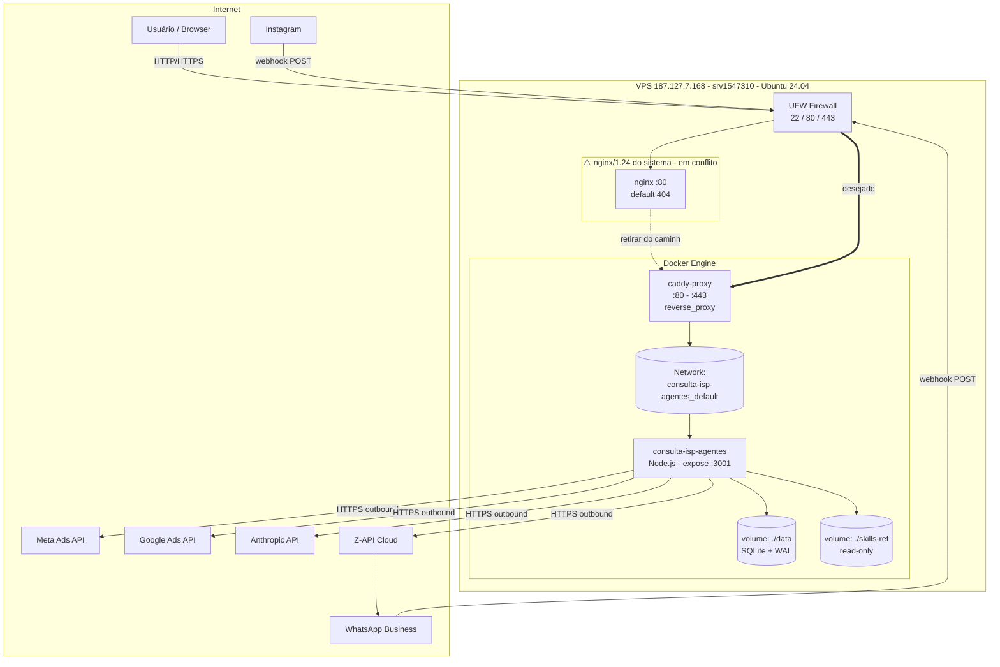

**Estado atual (16/04/2026):**

| Componente          | Status                            | Observação                                            |
| ------------------- | --------------------------------- | ----------------------------------------------------- |
| VPS 187.127.7.168   | ✅ Online                         | Ubuntu 24.04, Docker ativo                            |
| Container `agentes` | ✅ Up (healthy)                   | Node :3001 interno, startup OK                        |
| Container `caddy`   | ⚠️ Up mas shadowed                | Ouvindo :80/:443 no container, porém nginx host ocupa |
| nginx do sistema    | 🔴 Conflito                       | Bind em 0.0.0.0:80 respondendo 404 antes do Caddy     |
| UFW                 | ⚠️ Sem 3080                       | Permite 22/80/443 somente                             |
| Volume `./data`     | ✅ Persistente                    | SQLite WAL                                            |
| GitHub repo         | ⚠️ Divergência                    | fix-vps.sh / status.html / AUDITORIA só local         |

---

## 2. Visão Geral - Arquitetura Lógica

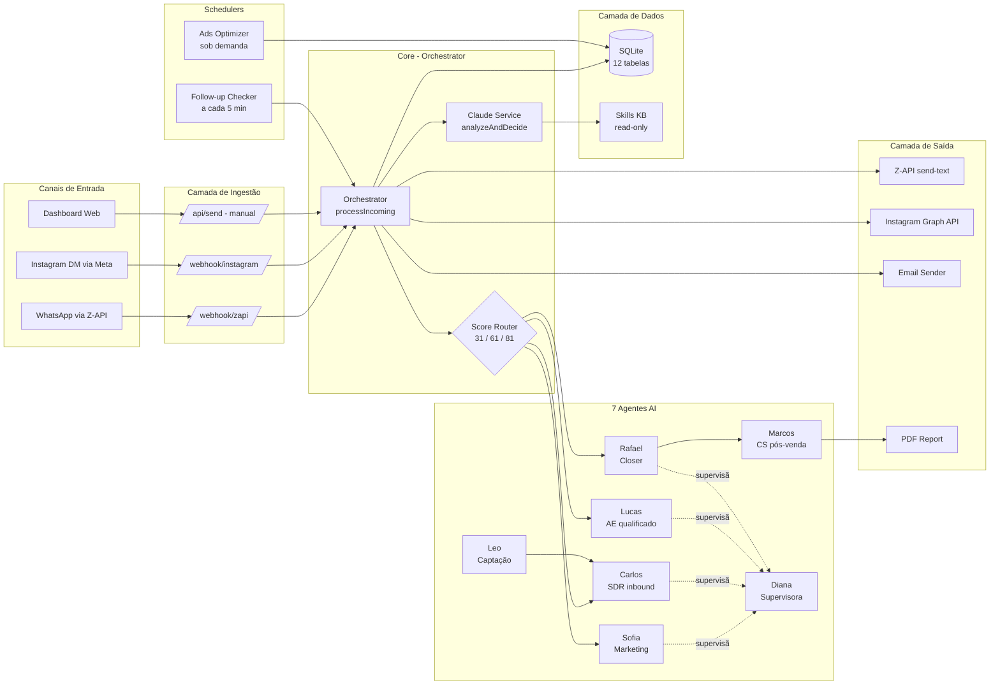

**Responsabilidades por camada:**

- **Ingestão** — recebe eventos externos (webhooks) e normaliza pro Orchestrator.
- **Core** — decide o quê fazer, quem deve responder, qual score atribuir.
- **Agentes** — personas com prompts especializados; cada um tem um estágio do funil.
- **Dados** — persistência de leads, conversas, métricas, follow-ups, A/B, handoffs.
- **Saída** — envia a resposta pelo canal correto (WhatsApp, Instagram, email).
- **Schedulers** — processos que rodam em background (follow-up, otimização de ads).

---

## 3. Fluxo de Entrada de Mensagens (Webhooks)

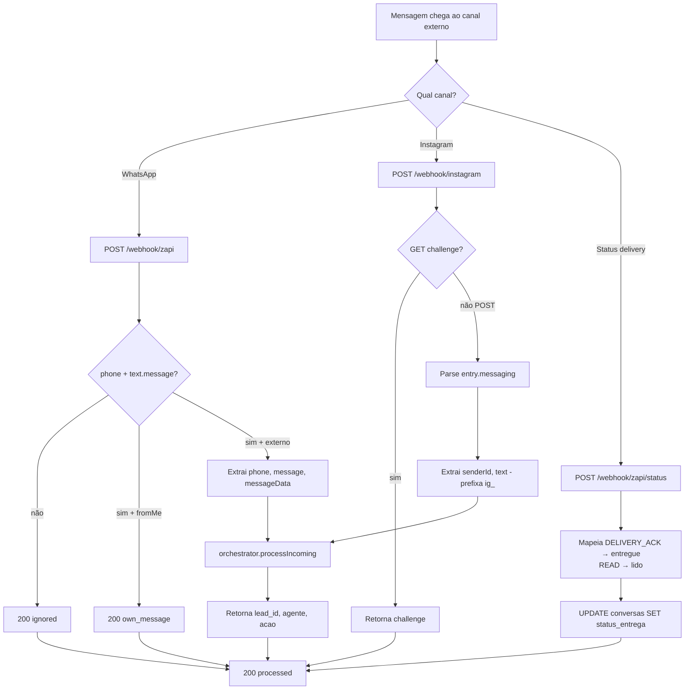

**Endpoints de entrada mapeados:**

| Endpoint                    | Método  | Fonte      | Autenticação            | Status atual |
| --------------------------- | ------- | ---------- | ----------------------- | ------------ |
| `/webhook/zapi`             | POST    | Z-API      | 🔴 NENHUMA              | Público      |
| `/webhook/zapi/status`      | POST    | Z-API      | 🔴 NENHUMA              | Público      |
| `/webhook/instagram`        | GET     | Meta       | verify_token (fraco)    | Público      |
| `/webhook/instagram`        | POST    | Meta       | 🔴 Sem HMAC X-Hub-Sig   | Público      |
| `/api/send`                 | POST    | Dashboard  | 🔴 NENHUMA              | Crítico      |
| `/api/leads`                | GET     | Dashboard  | 🔴 NENHUMA              | Vazamento    |
| `/api/prospectar`           | POST    | Dashboard  | 🔴 NENHUMA              | Crítico      |

> ⚠️ **Bloqueador de Onda 1:** Toda superfície de entrada está pública. Referência: AUDITORIA-COMPLETA §1.4 (SEC-01, SEC-03).

---

## 4. Pipeline do Orchestrator (Core Decision Flow)

```mermaid
flowchart TD
    IN[processIncoming phone, message, messageData]

    IN --> Q1{Lead existe?<br/>SELECT FROM leads WHERE telefone=?}
    Q1 -->|não| CREATE[INSERT lead<br/>agente_atual=carlos<br/>etapa=novo]
    Q1 -->|sim| LOAD[Carrega lead do DB]
    CREATE --> LOG1[log_activity: lead_criado]
    LOG1 --> LOAD

    LOAD --> INSERT_MSG[INSERT conversas<br/>direcao=recebida]
    INSERT_MSG --> METRIC1[updateDailyMetric<br/>mensagens_recebidas+1]

    METRIC1 --> CANCEL_FU[followup.cancelFollowups lead.id]
    CANCEL_FU --> AB_TRACK{Última msg enviada<br/>tinha A/B test?}
    AB_TRACK -->|sim| AB_RECORD[abTesting.recordResponse]
    AB_TRACK -->|não| HIST
    AB_RECORD --> HIST

    HIST[_getHistorico lead.id, 10] --> CLAUDE_CALL[claude.analyzeAndDecide<br/>agente_atual + historico + lead]

    CLAUDE_CALL --> OUT[analise:<br/>- resposta_whatsapp<br/>- dados_extraidos<br/>- score_update<br/>- acao<br/>- notas_internas]

    OUT --> UPD_DATA[_updateLeadData<br/>merge dados_extraidos]
    UPD_DATA --> UPD_SCORE[_updateScore<br/>score_perfil + score_comportamento]

    UPD_SCORE --> RELOAD[Recarrega lead atualizado]
    RELOAD --> HANDOFF{Score + agente<br/>dispara handoff?}

    HANDOFF -->|Carlos + score&gt;=61| H1[transferLead<br/>carlos → lucas]
    HANDOFF -->|Lucas + score&gt;=81| H2[transferLead<br/>lucas → rafael]
    HANDOFF -->|Carlos + 0&lt;score&lt;31| H3[transferLead<br/>carlos → sofia]
    HANDOFF -->|não| SEND

    H1 --> SEND
    H2 --> SEND
    H3 --> SEND

    SEND[INSERT conversas<br/>direcao=enviada<br/>metadata: acao + notas]
    SEND --> DISPATCH[_sendByChannel<br/>whatsapp / instagram / email]
    DISPATCH --> LOG2[log_activity: resposta_enviada]
    LOG2 --> METRIC2[updateDailyMetric<br/>mensagens_enviadas+1]

    METRIC2 --> MOD3{msgCount % 3 == 0?}
    MOD3 -->|sim| TRAIN[training.evaluateResponse<br/>async sem await]
    MOD3 -->|não| DONE
    TRAIN --> DONE[RETURN lead_id, agente, acao]
```

**Entradas e saídas do pipeline:**

| Input                      | Fonte                 |
| -------------------------- | --------------------- |
| `phone`                    | Webhook payload       |
| `message`                  | Webhook payload       |
| `messageData.type`         | Z-API ou Instagram    |
| `messageData.canal`        | Inferido pelo webhook |
| Histórico (últimas 10 msg) | SQLite                |
| Prompt do agente           | `training` service    |
| Skills KB (se conectado)   | `skills-knowledge`    |

| Output                  | Destino            |
| ----------------------- | ------------------ |
| Resposta WhatsApp       | Z-API send-text    |
| Atualização de lead     | Tabela `leads`     |
| Atualização de score    | Campos `score_*`   |
| Registro de conversa    | Tabela `conversas` |
| Handoff (se disparou)   | Tabela `handoffs`  |
| Métrica diária          | Tabela `metricas`  |
| Log de atividade        | Tabela `logs`      |
| Cancelamento follow-up  | Tabela `followups` |

---

## 5. Arquitetura dos 7 Agentes AI + Handoff

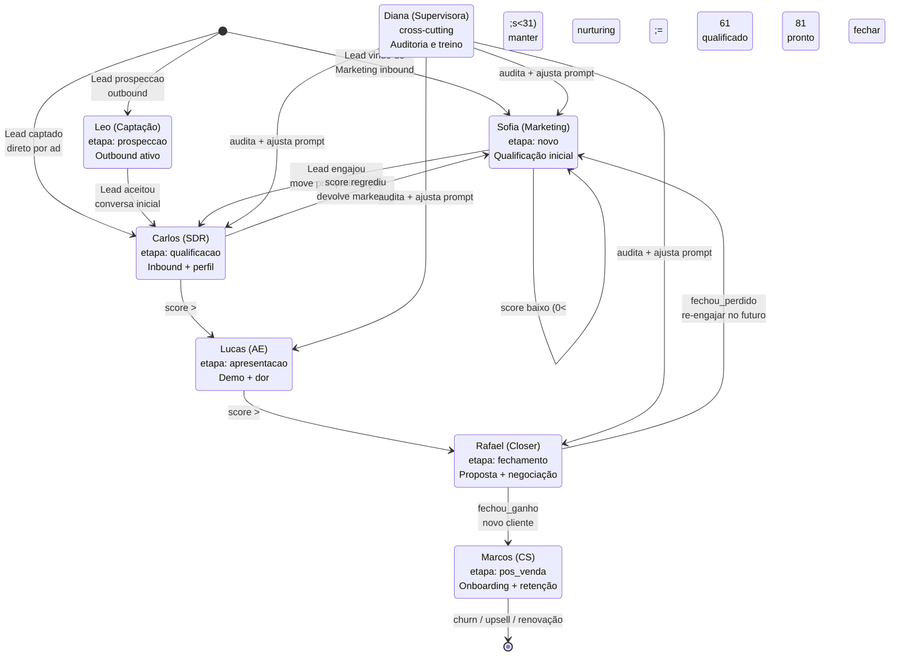

**Mapa de responsabilidades (todos vendendo o produto Consulta ISP para ISPs):**

| Agente  | Função                | Etapa do funil   | Gatilho de entrada                           | Saída possível                          | Conversação típica                                                                   |
| ------- | --------------------- | ---------------- | -------------------------------------------- | --------------------------------------- | ------------------------------------------------------------------------------------ |
| Sofia   | Marketing / nurturing | `novo`           | Lead inbound frio, score < 31                | Carlos (engajou) ou manter              | Educa sobre inadimplência em ISPs, envia material, cadência leve                     |
| Leo     | Captação outbound     | `prospeccao`     | Lista importada, ICP match                   | Carlos (aceitou conversa)               | "Sou Leo, ajudo ISPs a reduzir inadimplência. Vocês tem X clientes, posso mostrar?"  |
| Carlos  | SDR inbound           | `qualificacao`   | Default de novos leads                       | Lucas (score ≥61) ou Sofia (score <31)  | Descobre porte do ISP, ERP usado, % de inadimplência atual, decisor                  |
| Lucas   | Account Executive     | `apresentacao`   | Handoff do Carlos, score ≥61                 | Rafael (score ≥81)                      | Demonstra Consulta ISP, integração com ERP, casos de redução de inadimplência        |
| Rafael  | Closer                | `fechamento`     | Handoff do Lucas, score ≥81                  | Marcos (ganho) ou Sofia (perdido)       | Envia proposta, negocia preço/setup, agenda implantação                              |
| Marcos  | Customer Success      | `pos_venda`      | Fechamento ganho                             | Upsell, renovação, churn                | Onboarding da integração ERP, acompanha uso, identifica upsell                       |
| Diana   | Supervisora           | (cross-cutting)  | Sob demanda (auditoria)                      | Retroalimenta training de todos         | Analisa conversas dos outros 6, ajusta prompts, detecta erros de qualificação        |

**Regras de handoff (confirmado no código, `orchestrator.js:56-65`):**

```
if (agente = carlos) and (score >= 61):    carlos → lucas
if (agente = lucas)  and (score >= 81):    lucas  → rafael
if (agente = carlos) and (0 < score < 31): carlos → sofia
```

> ⚠️ **Gap identificado:** Não há regra automática pra lucas → sofia quando score cai. E não há handoff automático pra marcos após `etapa_funil = fechado_ganho` — depende de chamada manual.

---

## 6. Modelo de Dados (ER Diagram)

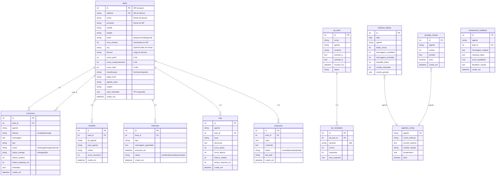

**Índices críticos que faltam (`AUDITORIA §1.3 Tech Debt`):**

- `conversas(lead_id, criado_em DESC)` — usado em `_getHistorico`
- `conversas(direcao, lead_id, criado_em DESC)` — usado em A/B tracking
- `leads(agente_atual, etapa_funil)` — usado no dashboard
- `followups(status, executar_em)` — usado no scheduler a cada 5 min
- `metricas_diarias(data DESC, agente)` — usado em `/stats`

---

## 7. Fluxo de Saída Multi-Canal

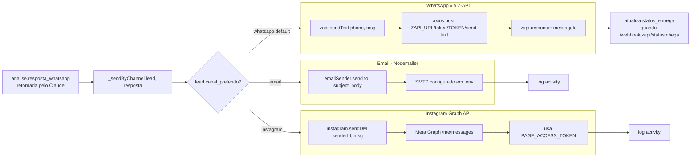

**Decisão do canal** (baseada em `messageData.canal` no webhook + `lead.canal_preferido` na DB):

| Origem                               | Canal usado na resposta |
| ------------------------------------ | ----------------------- |
| `/webhook/zapi` (phone `55XXXX`)     | whatsapp (padrão)       |
| `/webhook/instagram` (`ig_senderId`) | instagram               |
| Lead com `canal_preferido = email`   | email                   |

> ⚠️ **Débito:** Não há fallback caso o canal primário falhe. Se Z-API retornar 5xx, mensagem é perdida (tem log mas não fila de retry). Ver AUDITORIA §2.1 R7.

---

## 8. Scheduler de Follow-ups

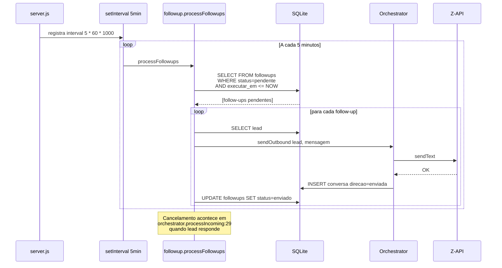

**Quando um follow-up é criado:**

- Agente decide em `analise.acao = "agendar_followup"` com `analise.dados_extraidos.followup_em`
- Ou manualmente via `/api/followups` (se exposto)

**Quando é cancelado:**

- Lead responde qualquer mensagem → `followup.cancelFollowups(lead_id)` zera todos os pendentes.

> ⚠️ **Débito Onda 2:** Scheduler é in-process `setInterval`. Se o container reiniciar no meio de um processamento, follow-ups podem ser executados em dobro ou perdidos. Ver AUDITORIA §1.3 TD-A5.

---

## 9. Integrações Externas (Meta + Google Ads)

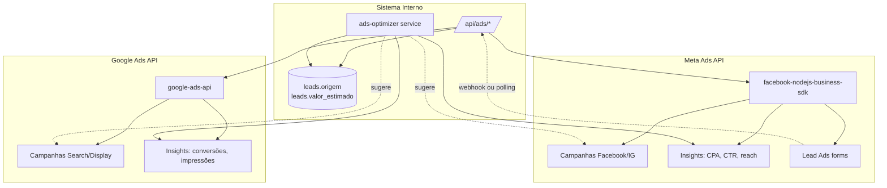

**Fluxo típico:**

1. Anúncio Meta/Google capta interesse → gera lead form submission.
2. Sistema (via polling ou webhook) importa o lead → INSERT em `leads` com `origem = 'meta_ads'` ou `'google_ads'`.
3. Carlos/Sofia assumem a conversa no WhatsApp (se capturou telefone) ou Instagram DM.
4. `ads-optimizer` cruza conversões fechadas × gasto de ads → sugere ajustes (pausa criativo, sobe budget, etc.)

> ⚠️ **Débito:** Não está claro se o webhook Lead Ads está configurado e protegido. Ver AUDITORIA §2.3 LGPD-03 (consentimento importado) e §1.4 SEC-12 (autenticação da ingestão).

---

## 10. Dashboard e API de Gestão

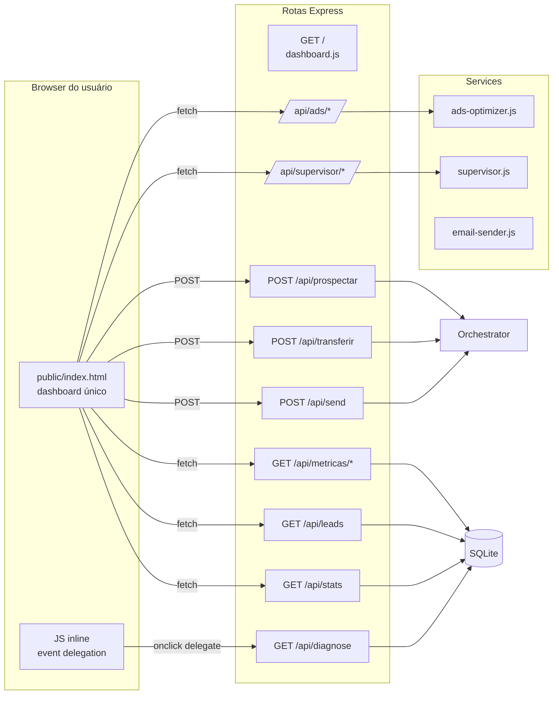

**Endpoints do dashboard agrupados:**

| Grupo           | Endpoints                                                                         | Uso                                   |
| --------------- | --------------------------------------------------------------------------------- | ------------------------------------- |
| Estatísticas    | `/api/stats`, `/api/metricas/*`, `/api/metricas/agentes`, `/api/metricas/historico` | KPIs, gráficos                        |
| Leads           | `/api/leads`, `/api/leads/:id`, `/api/leads/:id/conversas`                        | Lista, filtro, histórico              |
| Ação manual     | `/api/send`, `/api/transferir`, `/api/prospectar`                                 | Supervisor interfere no funil         |
| Supervisor IA   | `/api/supervisor/auditar`, `/api/supervisor/treinar`, `/api/supervisor/prompts`   | Diana audita, ajusta prompts          |
| Ads             | `/api/ads/meta`, `/api/ads/google`, `/api/ads/otimizar`                           | Integração Meta/Google                |
| Diagnóstico     | `/api/diagnose` (novo, só local)                                                   | Status da integração                  |

> 🔴 **Crítico:** Todos esses endpoints estão públicos. Ver AUDITORIA §1.4 SEC-03.

---

## 11. Fluxo Fim-a-Fim (Sequence Diagram)

Exemplo: Dono de ISP vê anúncio do Consulta ISP, manda mensagem no WhatsApp. Carlos (SDR) qualifica (pergunta porte, ERP, inadimplência atual), sobe score e faz handoff pro Lucas (AE) que vai marcar demo do produto.

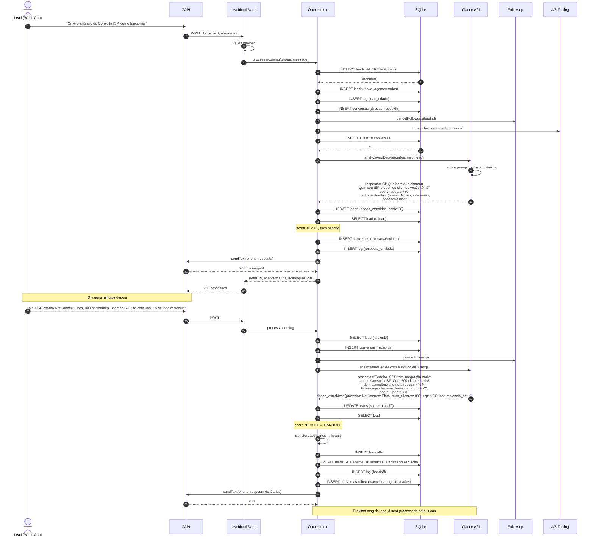

**Pontos de extensão/configuração durante o fluxo:**

- **Passo 8 (Claude)** — prompt do agente é carregado de `agentes_config.prompt_sistema`, mais override de `prompts_versao` se ativo.
- **Passo 18 (Z-API)** — se A/B test estiver rodando pra esse contexto, `abTesting.getVariant` escolhe variante A ou B e grava em `metadata`.
- **Passo 24 (Handoff)** — `transferLead` também resetaria follow-ups pendentes e pode mandar notificação interna.

---

## 12. Pontos Críticos de Atenção para o Fluxo

| # | Risco / Débito                             | Impacto no fluxo                                                          | Referência                    |
| - | ------------------------------------------ | ------------------------------------------------------------------------- | ----------------------------- |
| 1 | Webhook sem HMAC/Auth                      | Qualquer um injeta leads falsos ou executa envio manual                   | AUDITORIA §1.4 SEC-01         |
| 2 | API sem auth                               | Dashboard exposta sem login; dados de PII vazam em `/api/leads`           | AUDITORIA §1.4 SEC-03         |
| 3 | Token Z-API na URL                         | Aparece em logs nginx/Caddy/Morgan                                        | AUDITORIA §1.4 SEC-05         |
| 4 | Race condition no INSERT leads             | Mesmo telefone em duas webhooks simultâneas pode duplicar                 | AUDITORIA §1.1 C7             |
| 5 | Sem rate limit outbound                    | Risco de WhatsApp banir número se disparar em massa                       | AUDITORIA §2.1 R1             |
| 6 | Sem opt-out (STOP)                         | LGPD + Meta Business Policy violados                                       | AUDITORIA §2.3 LGPD-07, WA-02 |
| 7 | Scheduler in-process                       | Restart do container perde/duplica follow-ups                             | AUDITORIA §1.3 TD-A5          |
| 8 | Nginx + Caddy conflito na :80 (deploy)     | Dashboard inacessível externamente hoje                                   | RECUPERACAO-DASHBOARD §Etapa A|
| 9 | Sem backup automatizado do SQLite          | Perda total se VPS tiver falha de disco                                   | AUDITORIA §2.1 R2             |
| 10| A/B test contabiliza envio antes do ack    | Métricas infladas se envio falhar                                         | AUDITORIA §1.1 F3             |

---

## Legenda de cores

- 🟢 / ✅ = Implementado e funcional
- 🟡 / ⚠️ = Implementado mas com débito conhecido
- 🔴 = Bloqueador crítico — tratar em Onda 0 ou Onda 1
- ⬛ = Não implementado, planejado

---

## Próximos passos relacionados à topologia

1. **Onda 0 (esta semana)** — resolver conflito nginx×Caddy, dashboard online, deploy files no GitHub (ver PROMPT-CLAUDE-CODE.md).
2. **Onda 1 (2 semanas)** — HMAC webhook, auth API, rate limit, opt-out, LGPD notice (ver AUDITORIA-COMPLETA §Plano de Ação).
3. **Onda 2 (1 mês)** — observabilidade estruturada, APM, tracing de request → CLAUDE → resposta.
4. **Onda 3 (2 meses)** — migrar scheduler pra BullMQ + Redis (persistente, distribuído).
5. **Onda 4 (3 meses)** — filas de mensageria pra outbound (resiliente, dispara em batch controlado).

---

**FIM da Topologia.** Para detalhes de cada risco/débito citado, consultar `AUDITORIA-COMPLETA.md`. Para instruções de execução do Claude Code, consultar `PROMPT-CLAUDE-CODE-ONDA0.md`.
