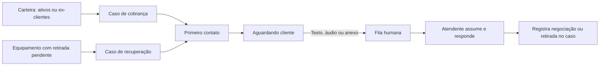

# Atendimento integrado — cobrança e recuperação

Análise e implementação local de 06/09/2026. Referências: Consulta ISP,
`F:/Provedor.ai`, telas fornecidas e os três repositórios ChatBullQ.

## Decisão de produto

O atendimento passa a fazer parte do trabalho do operador: escolher a carteira,
abrir o caso, conversar com o cliente e registrar o resultado. O chat conserva o
histórico; o caso continua sendo a fonte da dívida, negociação e retirada.

Encerrar a conversa não quita a dívida, não dá baixa patrimonial e não confirma
a recuperação. Esses resultados dependem das operações correspondentes no caso.

## O que foi implementado

| Área | Comportamento |
| --- | --- |
| Cobrança → Conversas | Fila interna por carteira, situação, nome e página; abertura pelo kanban e Cliente 360. |
| Equipamentos → Conversas | Fila própria, entrada pelo caso de recuperação e conversa dentro do painel do caso. |
| Atendimento | Histórico paginado, envio de texto, situação da mensagem, assumir, encerrar e reabrir. Anexos recebidos podem ser abertos. |
| Contexto | Cliente, dívida, carteira, tom DNA, orientação da régua, equipamento, MAC, série e acesso ao caso. |
| Primeira resposta | Webhook assinado interrompe a resposta por IA e encaminha a conversa à fila humana. Inclui áudio/anexo. |
| Primeiro contato automático | Configuração por administrador, módulos e carteiras escolhidos, limite diário e pausas. Desligado por padrão. |
| Cliente 360 | Login, IP, MAC, contrato, série e estado online quando fornecidos pelo ERP; nenhum campo de senha é exposto. |
| Identificação técnica | Normalização e comparação de MAC/série com o inventário do cliente, distinguindo coincidência, ambiguidade, conflito e dado ausente. |

Uma conversa pode pertencer a cobrança e equipamentos quando vinculada aos dois
casos. A seleção do módulo não apaga o vínculo anterior. Consultas e operações
usam o provedor da sessão; identificadores enviados pelo navegador não trocam o
provedor ou o operador. As ações relevantes entram na linha do tempo dos casos.

## Como os agentes se encaixam

O fluxo entregue usa **modelos de primeiro contato e regras determinísticas**.
O agente se identifica como assistente virtual, inicia a conversa e aguarda a
resposta. Não exige inferência de LLM para cada cliente nem deixa um modelo decidir
se deve transferir. A primeira resposta é encaminhada por código ao humano.

O agente generativo opcional foi orientado ao mesmo escopo. Novos agentes não
recebem a skill de registrar promessa. No modo de primeira resposta humana, o
endpoint também impede o registro autônomo de promessa, inclusive para agentes
antigos que ainda tenham essa skill. Agentes já cadastrados no serviço remoto
não tiveram seus prompts alterados em produção nesta tarefa.

Os projetos públicos examinados foram:

- [chat-bullq-api](https://github.com/jpasv/chat-bullq-api), revisão `10c14f8`:
  NestJS, Prisma e filas BullMQ; transporte, mensagens, agentes e transferência.
- [chat-bullq-web](https://github.com/jpasv/chat-bullq-web), revisão `82852ed`:
  referência de inbox e contratos da API. A interface interna foi construída com
  React e os componentes do Consulta ISP, sem embutir outro aplicativo.
- [chat-bullq-mcp](https://github.com/jpasv/chat-bullq-mcp), revisão `4ac8cae`:
  ferramentas de leitura de contexto e indicadores; não fornece transporte de
  mensagens ou um motor pronto de cobrança.

**Compatibilidade:** o adaptador já existente no Consulta ISP usa um fork com
provisionamento `/platform`, ação `call_webhook` e controle `aiEnabled` na abertura
da conversa. Os repositórios públicos examinados não implementam esses patches.
Apontar o adaptador diretamente para uma instalação upstream não é suficiente.
O serviço deve aceitar a abertura com IA desligada e entregar o webhook de
mensagem recebida; falha na configuração do webhook impede o primeiro envio.

A API pública examinada usa Sakana para inferência. A configuração legada do
Consulta ISP ainda permite `CHAT_BULLQ_AGENTE_MODELO` e tem um modelo OpenAI como
padrão. Esse modelo deve ser compatível com o fork instalado caso o administrador
queira usar o agente generativo opcional. O fluxo nativo de primeiro contato
entregue não depende dessa configuração de LLM.

## Régua e DNA

As responsabilidades permanecem separadas:

1. A régua seleciona a etapa pelo atraso e pela carteira, respeitando a política.
2. A orientação seleciona o papel operacional da etapa. Vulnerabilidade exige
   acolhimento humano; uma propensão válida pode orientar negociação, mas não
   remove uma etapa que exige revisão humana.
3. O DNA 3×3 seleciona a forma de falar. Mudar de A1 para C3 não muda o calendário
   nem libera uma ação financeira. Os nove tons têm aberturas próprias.

A propensão não é fabricada: o contrato de orientação aceita um valor validado,
mas os novos endpoints não inventam um score quando o caso não tem esse dado.

Há duas limitações importantes no modelo atual que merecem a próxima evolução:

- `shared/cobranca/dna.ts` documenta histórico de pagamentos insuficiente na fase
  atual. A grade é uma heurística operacional; não deve ser apresentada como
  probabilidade estatística de pagamento. A regra chamada “em dia” admite até
  30 dias de atraso, o que precisa ser separado do estado financeiro da fatura.
- O pré-aviso D-7/D-3/D-1 existe na régua, mas depende de faturas a vencer. A nova
  agenda busca casos abertos com dívida vencida, portanto não promete disparos
  preventivos que a ingestão atual ainda não sustenta.

Melhoria recomendada: importar faturas pagas e a vencer, calcular pontualidade por
janela e quantidade de observações, mostrar confiança e data de atualização,
versionar a regra e medir resposta/pagamento por etapa. A propensão deve ser
avaliada com resultados posteriores e não derivada apenas do quadrante DNA.

## Funcionamento da agenda

- API e worker compartilham travas por provedor/telefone para reduzir introduções
  simultâneas. A conversa existente é consultada antes de abrir outra.
- A agenda roda a cada minuto, com até cinco candidatos executados por rodada,
  dentro do teto diário configurado. Conversas manuais novas também consomem o
  teto diário, como limite conservador de volume.
- Cobrança considera casos abertos, sem contato anterior e com dívida. Retirada
  considera casos em pré-recuperação, abertos e não contestados.
- Clientes com conversa já registrada ficam fora da agenda de primeiro contato.
  A equipe pode continuar/vincular o atendimento manualmente.
- São respeitados horário configurado, sábado habilitado, pausas e calendário
  operacional. Domingos e datas nacionais configuradas não recebem disparos.
  Datas municipais/estaduais e outras pausas podem ser informadas pelo provedor.
- A desativação é consultada novamente durante a rodada. Um pedido já aceito pelo
  transporte pode terminar; não existe cancelamento retroativo de mensagem.
- A seleção atual examina os 100 casos mais antigos por módulo. Falha de
  transporte interrompe a rodada daquele provedor; erros ficam no log do worker.
  Paginação contínua e uma fila visível de falhas são evoluções necessárias para
  carteiras grandes ou cadastros com muitos telefones inválidos.

O calendário operacional é uma configuração de contato, não uma declaração de
que a agenda cobre todas as regras locais. Referência de datas consultada:
[calendário federal de 2026](https://agenciagov.ebc.com.br/noticias/202512/confira-o-calendario-oficial-de-feriados-nacionais-e-pontos-facultativos-em-2026).

## Cliente 360 e OLT

A leitura técnica usa os dados que SGP e IXC efetivamente devolvem. No SGP,
login/MAC do serviço não comprovam uma sessão online. No IXC, a informação de
autenticação utiliza a consulta RADIUS existente. Campos ausentes permanecem
ausentes; endereço MAC é normalizado sem inferir fabricante ou posse.

O cruzamento atual usa o inventário do cliente. **Não há coleta OLT implementada.**
Coincidência de MAC/série é evidência de cadastro, não confirmação de equipamento
na residência. O snapshot consultado ao vivo também não substitui histórico
persistente: ERPs podem apagar o vínculo técnico após cancelamento.

Próxima etapa recomendada: adaptadores OLT por fabricante com leitura apenas,
registro de origem e instante, OLT/slot/PON/ONU-ID, serial óptico, MAC WAN/LAN e
login PPPoE separados. A associação deve considerar múltiplos contratos,
equipamentos roteados, troca de aparelho, MAC duplicado e dados desatualizados.
Conflitos vão para conferência humana, sem alterar patrimônio automaticamente.

## Ativação e operação

1. Disponibilizar a API e o worker do Consulta ISP com as alterações locais.
   Esta tarefa não publicou código nem executou migração; utiliza tabelas atuais.
2. Conferir no servidor `CHAT_BULLQ_URL` e `CHAT_BULLQ_PLATFORM_KEY`. Nunca enviar
   essas credenciais ao navegador. O ChatBullQ deve ser o fork compatível descrito.
3. Configurar `CHAT_BULLQ_WEBHOOK_URL` com a URL pública desta instalação, terminando
   em `/api/webhooks/chat-bullq`. O padrão legado aponta para consultaisp.com.br.
   Para agentes opcionais, conferir também `CHAT_BULLQ_AGENTE_URL` e o modelo.
4. No Painel do Provedor → Chat, conectar e testar o número de WhatsApp.
5. Validar com um número de teste: primeiro contato, resposta, fila humana,
   assumir e continuar; então configurar módulos, carteiras, teto e pausas.
6. Só habilitar a agenda quando o worker e o retorno do webhook estiverem
   operacionais. A configuração permanece desligada por padrão.

O envio atual é de texto. Recebimento de mídia está disponível; envio de anexos,
áudio pelo operador e atualização via WebSocket ficam para outra etapa. A tela
consulta atualizações periodicamente. “Assumir” representa atendimento pela
equipe, com autoria registrada nos eventos; não há trava exclusiva por atendente.

## Evoluções prioritárias para uma operação indispensável

| Prioridade | Entrega | Resultado mensurável |
| --- | --- | --- |
| 1 | Caixa de falhas, paginação da agenda, tentativas idempotentes e alerta de webhook atrasado | Nenhum contato perdido silenciosamente; redução de trabalho de conferência. |
| 1 | Dono exclusivo do atendimento, SLA e próxima ação obrigatória | Tempo até resposta humana e casos sem acompanhamento. |
| 1 | Histórico de faturas, pagamento conciliado e pausa por contestação/opt-out centralizados | Menos cobrança indevida; recuperação confirmada, não apenas promessa. |
| 2 | Histórico técnico persistente e importação OLT com evidências | Percentual de aparelhos identificados sem conflito. |
| 2 | Agenda de retirada, rota, confirmação e comprovante de recebimento | Custo por retirada e patrimônio efetivamente recuperado. |
| 2 | Cliente 360 com eventos unificados, economia e origem de cada indicador | Decisão de negociação ou recuperação apoiada em dados verificáveis. |
| 3 | Propensão calibrada, comparação de abordagens e agentes assistivos com limites | Recuperação incremental e custo por resultado, sem confundir score com DNA. |

## Validação local

Resultado atualizado: **4.232 testes aprovados em 212 arquivos**. Registro completo em
`work/test-chat-perfil-final.log`; checagem de tipos em `work/tsc-chat-perfil-final.log`.

Foram usados testes com transporte e banco simulados e uma interface em localhost
com dados sintéticos. Nenhum cliente real recebeu mensagem. Cobertura inclui
isolamento de provedor, webhook assinado, primeira resposta, falha ao desligar IA,
limites/pausas da agenda, mídia pertencente à conversa e autenticação sem senha.

O smoke visual cobriu cobrança, equipamentos, versão desktop/celular, assumir,
responder, encerrar/reabrir e dados do caso, sem erros capturados no console.
Build Vite e empacotamento da API/worker foram executados separadamente em `work`.
Isso não equivale a validar a integração remota ou uma implantação de produção.

A checagem de tipos apresenta 60 erros preexistentes em arquivos fora desta
entrega; as mensagens coincidem com o registro anterior. Não há script de lint
configurado no projeto. Esses pontos impedem declarar a base inteira pronta
para produção, mesmo com os testes funcionais da mudança passando.

## Complemento: ficha do cliente e pagamento dentro do chat

Os dois módulos usam a mesma tela de três colunas: lista filtrável, conversa e
ficha do cliente. A ficha reúne documento, contato, plano/mensalidade quando
identificados, contrato, tempo de casa, endereço, régua, DNA, pagamentos
confirmados, dívida, atraso, crédito, propensão, login/MAC/IP/série e retiradas
abertas. Dados ausentes aparecem explicitamente; baixar uma fatura do ERP não
conta como pagamento confirmado. Ordens técnicas ainda não integradas não são
apresentadas como inexistentes.

“Enviar PIX / 2ª via” seleciona uma fatura do cliente, consulta o instrumento
disponibilizado pelo ERP, permite abrir/copiar o boleto ou código e insere os
dados no rascunho. Antes da consulta, o servidor confere novamente as pendências
atuais e o vínculo cliente/provedor. Valor e vencimento corrigidos pelo ERP são
preservados. A inserção não envia a mensagem: o operador confere e usa Enviar.

- MK: consulta `WSMKSegundaViaCobranca` usando o código da fatura, conforme a
  [documentação oficial](https://mkloud.atlassian.net/wiki/spaces/MK30/pages/48699908/APIs%20gerais).
- SGP: consulta `POST /api/ura/fatura2via/`, seleciona o título e solicita
  `nao_gerar_os=1`, conforme a [coleção oficial](https://documenter.getpostman.com/view/6682240/2sB34hHg2V).
- IXC: aproveita a linha digitável quando devolvida na leitura dos títulos.
  Não cria um endereço de boleto presumido.

“Parcelar” abre a negociação existente com a política do provedor, e “Cliente
360” abre a ficha ampliada. No celular, “Dados do caso” abre o painel completo;
inserir o boleto retorna ao rascunho. O widget de suporte da plataforma fica
oculto nas duas rotas de atendimento para não cobrir o botão de envio.

O smoke visual deste complemento cobriu desktop e celular, consulta de segunda
via, preservação dos códigos no rascunho e abertura do parcelamento. Os testes
incluem recusa de outro cadastro/fatura, falha ou leitura parcial do ERP, escopo
do provedor e formatos dos conectores. Não foi alterado o schema nem executada
migração. A homologação com o ERP e o WhatsApp reais continua pendente.

## Complemento: três transportes e agentes reais (06/09/2026)

Conversas passou a ser o primeiro item em Cobrança. Clientes Ativos e Ex-Clientes
agora têm menus próprios, com visão geral, fila, Kanban e régua/DNA preservando a
carteira em todos os destinos.

O Painel do Provedor → Chat oferece Zappfy, Uazapi e Datafy. Os dois primeiros
usam token de instância com QR/pareamento; Datafy usa seu contrato oficial,
assinatura de webhook e template aprovado por operação. O catálogo é revalidado
antes do envio, e dados de canal/organização são conferidos contra o provedor.

Três agentes separados preparam mensagens reais pelo modelo disponível no
ChatBullQ. O teste gera prévia sem envio. A primeira resposta é encaminhada ao
humano. Patches permanentes e instruções: integrations/chat-bullq/README.md.

Consulta ISP está em http://127.0.0.1:5000 e ChatBullQ real em
http://127.0.0.1:3002, com PostgreSQL/Redis próprios. A API da ponte foi validada
localmente, incluindo provisionamento da organização e resposta honesta de IA
sem credencial. O banco principal foi preservado. A régua automática local está
desligada; nenhum envio de WhatsApp ou chamada paga de IA foi realizado.

Build frontend/backend e build/typecheck Nest passaram. O typecheck geral do
Consulta ISP mantém 60 diagnósticos preexistentes, sem novos no comparativo.
A suíte completa executou 4.319 testes; duas expectativas antigas (menus e senha)
foram corrigidas, e os 115 testes focados passaram após essas correções. Os
conectores também passaram 63 testes Nest e 37 testes do cliente HTTP.

Falta cadastrar credenciais de WhatsApp e IA e disponibilizar webhook HTTPS
externo para homologar envio/recebimento de um número real.
